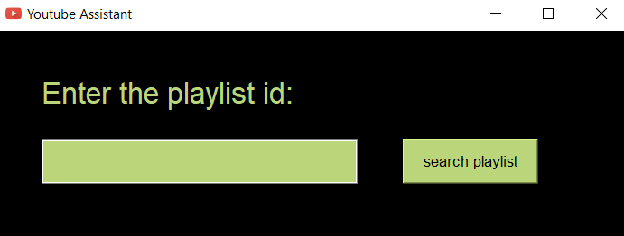

<h1 align="center">You-tube Assistant</h1>

  
   
  <i>Quickly calculating the playlist length and number of videos instead of doing it by hand
     extremly useful with the very long play list</i>
   

## Table of contents

- [Quick start](#Quick-start)
- [Step by step installation](#installation)
- [How to use it](How-to)

## Quick start

- in order to run this code you should install `python3` on your machine `pip install python3`
- Clone the repo `git clone `

## installation

First visit this [link](https://console.developers.google.com/)  

1- if you dont have any projects yet you should see `CREATE PROJECT` or you may find `New project` if you already did before, so after creating a new one give your project a name. then click `CREATE` 
2- then we have to enable our api, so click `api library` and search for youtube data api then click enable 
3- Now we need to make an api key, to do so, click on `CREATE CREDENTIALS` then it will ask you a couple of questions about what kind of credentials we need. 
  - `Which API are you using?` choose the api you just created which will be youtube data api  
  - then `Where will you be calling the API from?` choose other non-UI  
  - Finally below `What data will you be accessing?` choose public data which will do the job in our project.  
then click What credentials do i need?
and you should now be seeing the api key `COPY` that key and clilck done. 

We need to add this key to the enviroment variable to keep it away from the code 

For windows  
1- open control panel 
2- select system and security 
3- navigate to system 
4- on the left choose advanced system settings 
5- click on environment variables 
under user variables click new then name the variable `YT_API_KEY` and put you key in the value and click ok. pay attention to this name here because it is used in the code and if 
you named it something else it will not wort unless you update the code. 

For Mac & Linux: 
1- open you terminal and navigate to the home by typing `cd` 
2- open the path file in any text editor EX: `nano .bash_profile` 
3- at the top of the file type `export YT_API_KEY = ""` and in the double quotes insert the key we've generated above 
4- save the file 

## How to

open any playlist you want and from the url grab the playlist id, you will found it after the equal sign.  
then paste it and click search playlist

